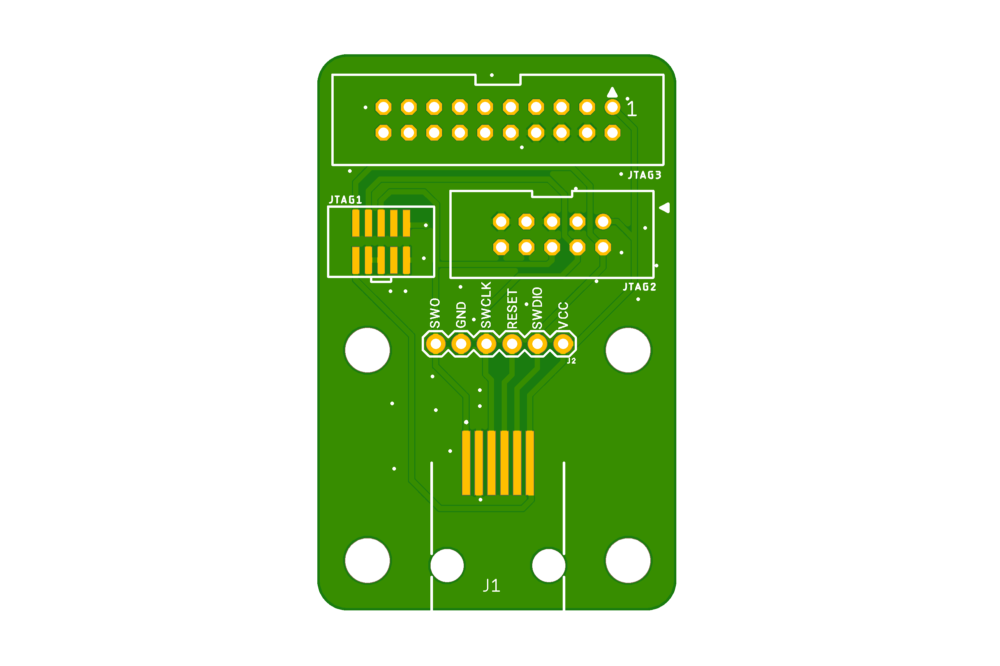

# TC2030-MCP-NL-SWD-Adapter

Works for both NL and hook version of course. NL is just what I personally use.
Breaks out the RJ12 connector from the TC2030-MCP to common SWD connectors and standard pin headers.
Tested with actual target PCB to be following the pinout correctly.

BOM
----

- Molex 95501-6669 (RJ12)
- Samtec FTR-105-02-G-D (2x5 pin 1.27mm SMT un-shrouded) (or use the typical shrouded connector) Cheaper here: https://s.click.aliexpress.com/e/_A3X57A
- Molex 90130-1110 (2x5 2.54mm PTH Shrouded)
- Molex 90130-1120 (2x10 2.54mm PTH Shrouded)

For the cable itself, the following Mouser PNs are the MCP variant:

NL version:
- 579-TC2030-MCP-NL 

With hooks:
- 733-53025-851
- 579-TC2030-MCP

For DigiKey:
- TC2030-MCP-NLTC-ND
- TC2030-MCPTC-ND

